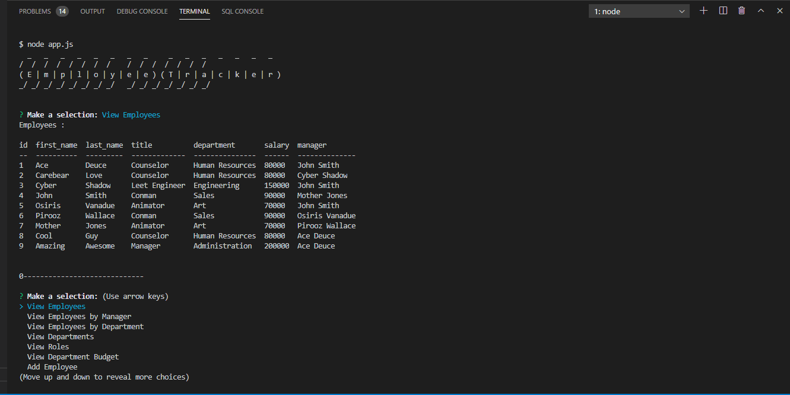

## Employee Tracker

by Pirooz Wallace
1/2/21


[](#license)

GitHub Repo: [Template Repo](https://github.com/attack-theoRy/SQLEmployeeTracker)

Portfolio: [Portfolio](https://attack-theory.github.io/Portfolio/)

Walkthrough Video : [Walkthrough Video](https://drive.google.com/file/d/1gCgY5ke2qu8ndhm0v2H2EVcgeaNrkAPL/view?usp=sharing)


## Table of Contents
* [API's + Tech](#tech)
* [Description](#description)
* [Installation](#installation)
* [License](#license)
* [Questions](#questions)

## Tech
* Node.js
* Inquirer Package
* Console.table
* MySQL (Workbench)


## Description

This app uses Node.js, MySQL and the command line / terminal to manage a database of employees. There are three tables: an employee table, a department table and a role table and they create the "company_db" (company database). 



There are a bunch of commands you can use to manipulate the database:
View Employees, Departments, Roles
View Employees by Manager or Department
Create (Add) Employee, Roles, Departments
Update Employee Roles, Manager
Delete (Remove) Employee, Department, Role

App uses console.table to display the tables and inquirer for the prompts


## Installation

To use properly you need to install Node.js and in the terminal you have to use the command 
``` npm init -u ```
and then also
``` npm install inquirer ```  to initialize and then install the correct dependencies, in this
case, inquirer.

``` npm install MySQL  ``` to install MySQL

The databases were seeded separately using MySQL Workbench with the 'seedtables.sql' file.

Type ``` npm install console.table --save ``` to install the console.table dependency used to show the database


And then finally to start the application you type ``` node app.js ``` in the terminal.

## License

MIT License

Copyright (c) [2020] [Pirooz Wallace]

Permission is hereby granted, free of charge, to any person obtaining a copy
of this software and associated documentation files (the "Software"), to deal
in the Software without restriction, including without limitation the rights
to use, copy, modify, merge, publish, distribute, sublicense, and/or sell
copies of the Software, and to permit persons to whom the Software is
furnished to do so, subject to the following conditions:

The above copyright notice and this permission notice shall be included in all
copies or substantial portions of the Software.

THE SOFTWARE IS PROVIDED "AS IS", WITHOUT WARRANTY OF ANY KIND, EXPRESS OR
IMPLIED, INCLUDING BUT NOT LIMITED TO THE WARRANTIES OF MERCHANTABILITY,
FITNESS FOR A PARTICULAR PURPOSE AND NONINFRINGEMENT. IN NO EVENT SHALL THE
AUTHORS OR COPYRIGHT HOLDERS BE LIABLE FOR ANY CLAIM, DAMAGES OR OTHER
LIABILITY, WHETHER IN AN ACTION OF CONTRACT, TORT OR OTHERWISE, ARISING FROM,
OUT OF OR IN CONNECTION WITH THE SOFTWARE OR THE USE OR OTHER DEALINGS IN THE
SOFTWARE.

## Questions
For questions please contact: Pirooz Wallace

at : PiroozWallace@outlook.com

Github Profile: https://github.com/attack-theoRy
